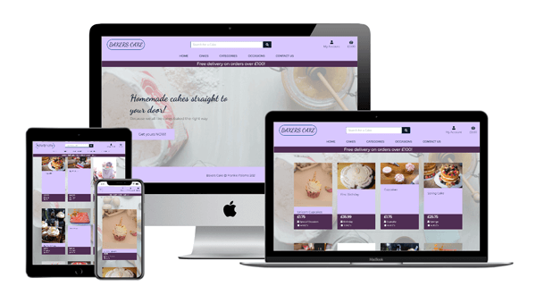
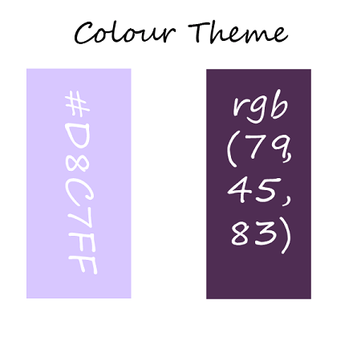
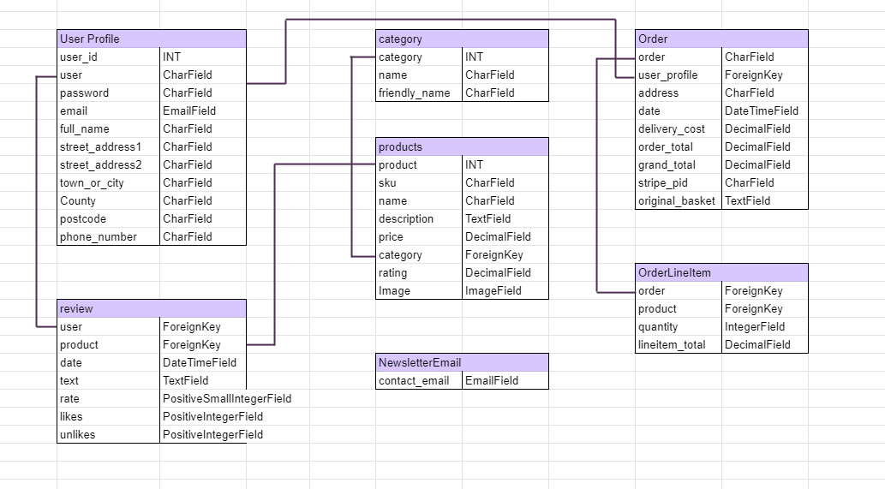
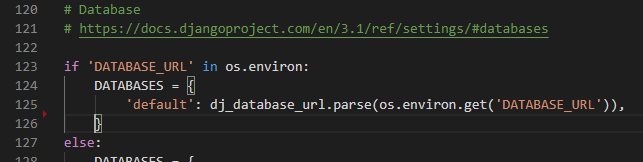

# Bakers Cake

---
My Milestone 4 project 'Bakers Cake' has been built using all my knowledge gained from the Code Institute Academy, Full Stack Developer Course, from start to finish.

Bakers Cake is a fully responsive, custom-built full-stack website, designed and built with the users wants and needs first, whilst maintaining a high design standard and ease of use.

You can view the live website here. [Bakers Cake](https://bakers-cake.herokuapp.com/)

# Table of Content

1. [Aim of the site](#Aim)
2. [UX](#UX)
3. [Users Stories](#Users)
4. [Design Choices](#Design)
    * [Fonts](#Fonts)
    * [Colours](#Colours)
5. [Wireframes](#Wireframes) 
6. [Features](#Features)
7. [Future Goals](#Future)
8. [Technology Used](#Technology)
9. [Testing](#Testing)
	* [Issues and resolutions](#Issues)
10. [Deployment](#Deployment)
11. [Credits](#Credits)
    * [Content](#Content)
12. [Acknowledgements](#Acknowledgements)
13. [Disclaimer](#Disclaimer)

---

## 1. Aim of the site 

The Client has a small business where they bake cakes for local clients and now, they are ready to take it a step further and
expand the business to an online retail system where they can sell the cake to online customers anywhere within the UK and Channel Islands.

All the cakes are homemade and bake to order only using natural high-quality ingredients with no artificial preservatives.

There is a repertoire of cakes and cake samples from previous orders for the users choose from and get ideas for their needs and a form where the users.
can contact the shop owner to request a specific cake.

Due to the nature of the cakes baked fresh, the client will only dispatch to the UK and Channel Islands. All the cakes will be sent on a priority. 
shipping, next day delivery.

---
## 2. UX 

As the company is a small local based and the existing client base is small.
The main aim is to expand the company with shoppers and users with the following criteria:

1. Based within the UK & Channel Islands.
2. Are looking for home bake style cakes.
3. They want a choice of which type of cake is made of.
4. Likes to leave feedback from their experience and cake purchase.

To help this business to stand out from other online, the website needs to ensure that:
* Is easy to use and navigate.
* Don't overload the user with too many 'walls of text'.
* Reminds the user to leave feedback from their product purchase to help other users.
* Is easy to track down the previous orders purchased.
* A rating system for users to rate cakes.
* Reviews left by other users who purchase the cakes before.

---
## 3. User Stories 

**New user**.

New visitors to the website should be provided with the answers they need right away. These include:

* As a new user, I want to be able view a list of all the cakes available to purchase.
* As a new user, I want to be able view the cakes details, that includes the price, description,
     cake rating and an image.
* As a new user, I want to be able submit my email so I can subscribe to a newsletter and find out any deals.
* As a new user, I want to be able easily view the total of my shopping basket at any time so
     I can avoid spending too much.
* As a new user, I want to be able contact the shop owner before registering so 
    I can send them a message and confirm if they can produce the cakes I need.

**Register and New Users**

Registered users of the website will be provided with additional features which non-registered users will not benefit from.

* As a registered user, I want to be able to register for a new account so I can have a personal account and be able to view my profile.
* As a registered user, I want to be able to easily login or logout so I can access my personal account.
* As a registered user, I want to be able to easily recover my password in case I forget it so
 I can recover the access to my account.
* As a registered user, I want to be able to receive an email confirmation confirming the registering so I can verify that my account registration was successful.
* As a registered user, I want to be able to have a personalized user profile so I can my personal order history and order confirmations and 
save my address details.

**Website shopper user stories**

All shoppers of the website, new, returning, or registered:

* As a shopper, I want to be able to sort the list of available cakes, so I easily identify the best rated, best priced and
categorically sorted cakes.
* As a shopper, I want to be able to see categories of cakes simultaneously so I can find the best priced or rated cakes. 
across broad categories, such as "birthday" or "sponge".
* As a shopper, I want to be able to search for a cake by name or description so I can find a specific cake I would like. 
to purchase.
* As a shopper, I want to be able to easily see what I've search for and the number of results so I can quickly decide whether the cake.
I want is available.
* As a registered shopper, I want to be able to easily rate a cake so I can rate any of the cake based on my experience.
* As a registered shopper, I want to be able to leave a review of a cake so I can review any of the cakes so other shoppers.
can see and help them decide.
* As a shopper, I want to be able to easily select the quantity of a cake or muffin when purchasing it so I can ensure I do not accidentally.
select the wrong cake or quantity.
* As a shopper, I want to be able to views the cakes in my bag to be purchased so I can identify the total cost of my purchase.
and all the cakes I will receive.
* As a shopper, I want to be able to adjust the quantity of individual cakes in my basket, so I easily make changes.
to my purchase before checkout.
* As a shopper, I want to be able to easily enter my payments information so I can check out quickly and with no hazzles.
* As a shopper, I want to be able to see my personal and payment information is safe and secure so I can provide the needed.
information to make a purchase.
* As a shopper, I want to be able to view and order confirmation after checkout so I can verify I have not made any mistakes.
* As a shopper, I want to be able to receive and email confirmation after checking out so I can keep the 
confirmation of what I've purchase for my records.

**Site Owner**

**Site owner user stories:**

As site owner I want the ability of adding any new cakes so I can expand the diversity of cakes choices the store can sell.

Also, I would like to be able to edit or update any cake so I can change the cake prices, description, images and other.
cakes criteria.

The store owner would like the ability to delete a cake so they can remove a cake that they are no longer for sale.

As the site owner, I want to be able to offer visitors free delivery based on a minimum amount ordered so that I can increase revenue and product sales via an incentive to the customer.

As shop owner I would like the ability to edit or update a review or rate so I can edit or delete any reviews or rate
 of any cake.

---

## 4. Design Choices 

### Fonts 

* [Dancing Script](https://fonts.google.com/specimen/Dancing+Script) To git the titles and headers a friendly informal and spontaneous look.

* [Montserrat](https://fonts.google.com/specimen/Montserrat) For a lighter and better reading on longer texts.

### Colours 

* For the main colour I decided to use a mild lavender colour #D8C7FF
* For the darker theme, hover buttons and banners I went for a darker purple rga(79, 45, 83)

---

## 5. Wireframes Mockups: 
Mockups of the website was made using [Balsamiq Wireframe](https://balsamiq.com/) to see how it would look for the different platforms like on large screens such as desktops and 
 on small screens such as a mobile phone:

* [Desktop](https://github.com/Dhracko/bakers_cake/blob/master/static/readme_docs/wireframes/Desktop.png)

* [Mobile](https://github.com/Dhracko/bakers_cake/blob/master/static/readme_docs/wireframes/Mobile.png)
 
---
### Other wireframes can be found here:
* [Basket](https://github.com/Dhracko/bakers_cake/blob/master/static/readme_docs/wireframes/Basket.png)
* [Cake Page](https://github.com/Dhracko/bakers_cake/blob/master/static/readme_docs/wireframes/Cakes-Page.png)
* [Checkout - Custome Info](https://github.com/Dhracko/bakers_cake/blob/master/static/readme_docs/wireframes/Checkout-Customer-Info.png)
* [Checkout successful](https://github.com/Dhracko/bakers_cake/blob/master/static/readme_docs/wireframes/Checkout-Success.png)
* [Email confirmation](https://github.com/Dhracko/bakers_cake/blob/master/static/readme_docs/wireframes/Email-Confirmation.png)
* [Product Page](https://github.com/Dhracko/bakers_cake/blob/master/static/readme_docs/wireframes/Product-Page.png)
* [Modal Add to basket](https://github.com/Dhracko/bakers_cake/blob/master/static/readme_docs/wireframes/Product-Page-Add-Basket.png)

---

## 6. Features 

**Navigation Bar:** 

**Sign up/Register & Sign In**
This is found under the My Account menu item where users can log in to their account or register for the site by creating a new account.

**Contact form:** 
The Contact page includes a form which submits messages from users directly to the site owner.

**Add item(s) to bag:**
This button allows users to add items to the bag without navigating away from the page they are on. 

**Select item quantity:**
On the product details page, users can select the number of items of that product.
they want to add to their basked using the + and – buttons, then ‘Add to Bag’.

**Update item(s) Quantity:**
On the bag page, users can update the number of items they wish to order of a product by
changing the quantity number using the + and – buttons, then click the ‘update’ button.

**Delete item(s) from the bag:**
Users can remove an item from the bag completely by clicking the ‘remove’ button beneath the item in their bag.

**Back to the top on selected mobile pages:**
Due to the small screen of the mobile devices, the website can become long to scroll up.
This will help the users to be taken straight to the top of the site with a click of the 'back to top' arrow.

**Rate the cakes:**
Registered users can rate the cakes from 0 to 5 by using the scroll down and clicking submit.

**Leave a review:**
Registered users can leave a short review of the cakes.

**Delete product (superuser only):**
Superusers can delete products easily by clicking the delete button found.
under the items on the Shop page or the individual product page.

**Update product (superuser only):**
Superusers can update the details of a product easily by clicking the delete button.
found under the items on the Shop page, or on the individual product page, and then amending the form.

---

## 7. Future Goals 

* Other register users can click on like or dislike a review left from other users.
* A posibility of collection instead of delivery.
* Admin can select to see only reviews done by a specific user.

---

## 8. Schema Design

I created the schema in 6 different part after taking in consideration all de different parts of the website:

* user_profile: These are the details that the user saves to their profile for quick checkouts in the future. The username, email address and password details are set when the user registers for the site, and the delivery details are added when the user makes a purchase and selects to save those details to their profile.

* order: This includes the overall order in full, including the delivery details from (from or added to the user profile) and the order_line_items.

* order_line_items: This includes details of each product the user orders, the details of each product are linked to the products section.

* products: This includes all the information related to each product, including the product item price, SKU, image, name, descriptions, category and rating. Products can only be added by a Superuser/Authenticated user.

* category: Linking to the category field in the products section, the Category model simply holds the categories which are chosen in the product model. These categories are pre-set and can only be modified or added to by a Superuser/Authenticated user.

* review: This will link to product. With this being linked to products so the review will only show on the product that is being linked to. Also a future feature where Admin can see the reviews done by a specific user. This can be added by any user but not modified.

The schema representation can be found 

---

## 9. Technology Used 

* HTML & CSS programming languages
* [Bootstrap](https://getbootstrap.com/) - to easily adapt the website to be responsive for all users. Version 4.4.1
* [Google Fonts](https://fonts.google.com/) – Dancing Script and Montserrat Styles
* [Font Awesome](https://fontawesome.com/) - Social Media Logos version 5.0.0
* [GIT](https://git-scm.com/) - Version Control
* [GitHub](https://github.com/) - to host the repositories for this project and the live website preview.
* [Balsamiq Wireframe](https://balsamiq.com/) - to create the Wireframes Mockups.
* [Autoprefixer](https://autoprefixer.github.io/) - to parses your CSS and adds vendor prefixes.
* [Amazon Web Services](https://aws.amazon.com/) - to storage the static files and the media files.

---

## 10. Testing 

### Code Validation

- Python - All code was run through [PEP8](http://pep8online.com/) and the [SolarLint](https://www.sonarlint.org/) plugin for VSCode was used. All code is PEP8 compliant.

- HTML - All code was run through the [W3C HTML Validator](https://validator.w3.org/) to ensure it was valid code and no errors were made.
 
- CSS - All styling was run through the [W3C CSS Validator](https://jigsaw.w3.org/css-validator/) to ensure it was valid and no errors were made.

- jQuery - All my script was run through the [JSHint](https://jshint.com/) validator and no errors were found.

### Manual Testing

I have extensively tested the site manually, making sure all the links and features works.
You can view the testing done in the [test.md](static/readme_docs/testing/test.md)

### Testing against user Story

For User story testing please refer to the [user_story_testing.md](https://github.com/Dhracko/bakers_cake/blob/master/static/readme_docs/testing/user_story_testing.md.md)

### Automated Testing

On top of the manual testing, I created automated testing for the 3 main apps with a total of 15 testing, following the advice of the short section at The Code Institute.

The code are included:
* Products > tests.py: Product form testing and Product page view test.
* Checkout > tests.py: Order form testing
* Contact > tests.py: Contact form testing

### Issues and resolutions 
 
* During the automated testing, I realised I set the postcode input value to "blank=True" but it's necessary for the card payment, to I changed to "False".
* In order to make the automated testing works I had to temporally remove the remote database.

--- 

## 11. Deployment 

Once I considered Bakers Cake was ready in a stable state to be deployed the project following process [here](static/readme_docs/deployment.md)

For local deployment:

1. I went to the repositories [Bakers Cake](https://github.com/Dhracko/bakers_cake).
2. on the top right click at Settings.
3. Scroll down until the section GitHub Pages.
4. Within that section there is a scrolldown option in "Source" and select "master branch".
5. Once the page has refreshed, scroll down again to GitHub Pages and a new link should have appeared with the link: https://dhracko.github.io/bakers_cake/.

To run the project locally:

1. Go to the repositories [Bakers Cake](https://github.com/Dhracko/bakers_cake).
2. Click on the green button that says "Clone or download".

3. To clone the repository using HTTPS, under "Clone with HTTPS", click . To clone the repository using an SSH key, including a certificate issued by your organization's SSH certificate authority, click Use SSH, then click .
4. Open Git Bash.
5. Change the current working directory to the location where you want the cloned directory to be made.

6. Type git clone, and then paste the URL you copied in Step 2.

> $ git clone https://github.com/Dhracko/bakers_cake

7. Press Enter. Your local clone will be created.

8. On Gitpod Environment Variables you need to have the following Variables:
    * SECRET_KEY
    * STRIPE_PUBLIC_KEY
    * STRIPE_SECRET_KEY
    * STRIP_WH_SECRET
    * DEVELOPMENT

Further information on how to clone a repository can be found [here](https://help.github.com/en/github/creating-cloning-and-archiving-repositories/cloning-a-repository).
---

## 12. Credits 

### Content

While some of the cakes images are of my own property, other have been optain from [Unsplash](https://unsplash.com/) invaluable site for royalty free images. 

## 13. Acknowledgements 
* I would like to thank Rohit Sharma (my mentor) for his invaluable feedback, help and advice.
* To the Tutor Stephen & Alan at Code Institute for showing the patient when I have got stuck with some code.
* I would like to thank to [Tony Teaches Tech](https://www.youtube.com/channel/UCWPJwoVXJhv0-ucr3pUs1dA) and his video. 
[How to Pass Values Between HTML Pages Using Django Forms](https://www.youtube.com/watch?v=vmP1r6xiJog&t=442s) which helped me to understand django and html relations.

## 14. Disclaimer 
Please note the content and images on this website are for educational purposes only.
