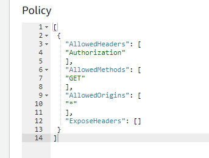
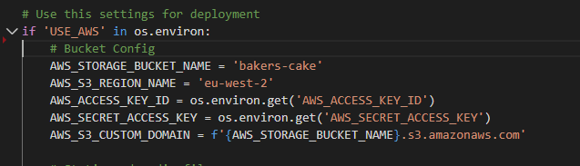
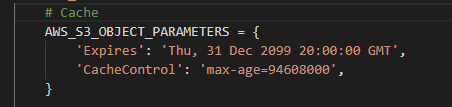

## Deployment

### Initial Deployment:

1. Open up https://dashboard.heroku.com/ and logged into my account

2. Create a new app: bakers-cake, selecting the location nearest me (Europe)

3. Under the ‘Resources’ tab, search for and add on the ‘Heroku Postgress DB’ app and add

4. Back at GitHub terminal, install ‘dj_database_url’ & ‘psycopg2’ by using the following
commands:
    * pip3 install dj_database_url
    * pip3 install psycopg2-binary

5. Use the command:
    * pip3 freeze > requirements.txt  to make sure Heroku installs all our apps requirements when we deploy the project.

6. In settings.py at the top, import the DJ database: ‘import dj_database_url’

7. Comment out the current ‘DATABASE’ settings (we will need them later), and add:
    * ‘default’: dj_database_url.parse(insert database URL here)
    * Add the Database URL into the () which you can find in the Heroku app under Settings – Reveal Config Vars - DATABASE_URL
8. Now we need to run all the migrations to get our database set up:
    * python3 manage.py migrate

9. Next, create a superuser using the command: python3 manage.py createsuperuser. I already
had a superuser account, but this would be the quickest process to do this should you need
to create one.

10. Now back in settings.py, remove the new database settings and uncomment out the original
settings. This stops the database URL going into version control.

11. Update the Database settings in settings.py with an if statement, so that when we are
running the app on Heroku it will connect to the database URL, otherwise we connect to site
to Sequel light.

12. Now to install gunicorn which will act as our webserver:
    * pip3 install gunicorn

13.  Freeze it to our requirements.TXT file as before in step 5

14. Create Procfile to tell Heroku to create a web dynamo, which will run unicorn and serve our
Django app:

15. Add this line of text to the Procfile: web: gunicorn bakers_cake.wsgi:application

16. Log into Heroku via the terminal with the command: heroku login -i
    * It will ask for email address and password.

17. Temporarily disable collect static using the following command: heroku config:set DISABLE_COLLECTSTATIC=1 --app bakers-cake (--app bakers-cake must be added as I
have more than 1 app in Heroku)

18. In settings.py, update the ‘ALLOWED_HOSTS settings. ‘Localhost’ allows GitPod to still work
too.
    * ALLOWED_HOSTS = [bakers-cake.herokuapp.com', 'localhost']

19. Finally copy all the environment variables for the project from Gitpod settings
to Heroku – Settings - Config Vars.

20. As I am using GitPod online, I must first initialise the Heroku before pushing to Heroku:
    * git remote: heroku git:remote -a bakers-cake

21. Finally, deploy to Heroku:
    * Git push Heroku master

22. Once the build in Heroku has completed, open the app by either clicking the link in the terminal, or the ‘Open App’ button in Heroku.

### Deployment in Amazon Web Services(AWS).
In order to deploy the media and the static files, I used AWS.

1. Visit https://signin.aws.amazon.com/. You would need to sign up and search for the S3 service.

2. Create a new bucket:
    * Name the bucket. I kept it simple using the name bakers-cake
    * Select the area closest to me (EU (London) EU-west-2
    * Uncheck the box to block all public access and acknowledge that the bucket
will be accessible by the public. This is because we need public access to our
static files.
    * Create Bucket.

3. Set up a few basic settings for the bucket:
    * Properties: Select static website hosting – enable.
    * Permissions: Cross-origin resource sharing (CORS). Add the code as per below provided by the course material for the Boutiqe Ado project.

   * Bucket Policy: select ‘Policy Generator’ to create a security policy for the bucket. Select the policy type: S3 Bucket Policy. Add * to Principal to allow all principals

    * Action: Get Object. Copy the Amazon Resource Name (ARN) from the Edit Bucket Policy tab and add to the form (in this case it is arn:aws:s3:::bakers-cake)

    * Click ‘add statement’

    * Generate policy. Copy the policy provided and paste it into the Edit Bucket Policy box on the AWS S3 page and add a /* on the end of the resource key to allow access to all resources in the bucket. Save changes

    * Access Control List tab, under ‘Everyone (public access)’ select the List option. Save changes.

4. Create User to Access the bucket: Here we will create a group for the user to live in, then create an access policy for the files, then assign the user to the group so it can 
use the policy to access all the files. We will use a new service for this within Amazon
Web Services called Identity and Access Management (IAM). Search for this by going
back to the AWS homepage and searching IAM. I have used this previously, so it was
in the list of recently visited services.
    * Create new group: named ‘manage-bakers-cake’
        * Click next step twice as we do not have a policy to attach as yet.
        * Click Create Group.
    
    * Create a policy: Now we need to create a policy to access the bucket. In the menu click Policies – Create Policy
        * On the JSON tab, select Import Managed Policy. This lets us import a policy pre-built by AWS. Search for S3 and select AmazonS3FullPolicy and import.
        * Nip back over to the S3, select our bucket, and copy the ARN (for us this is arn:aws:s3:::bakers-cake)
        * Head back to the IAM and update the “Resource” item as per the following so that we only allow access to the bucket.
        * Click review policy.
        * Update the details with a name and description. My project is as follows:
            - Name: bakers-cake-policy
            - Description: Access to S3 bucket for Bakers Cake static files.
            - Click ‘Create Policy’
            - Now attach the policy to the group we created by going to Groups –manage-bakers-cake – Permissions – Attach Policy
            - Search for the policy we created, select it, and click Attach Policy.
    
    * Create a user to add to the group
        * From the main menu, select Users – Add User:
            * Name: bakers-cake-staticfiles-user
            * Allow Programmatic access – next
            * Add the user to the group – select the manage-bakers-cake group
            * Click next through to the end as there is nothing else to change and click Create user.
            * Download the CSV file and keep this file safe. This file is not able to be downloaded again.
    
    * Connect the bucket to Django
        * Back in the project, Install two new packages:
            * pip3 install boto3
            * pip3 install django-storages
        * Freeze the requirements: pip3 freeze > requirements.txt
        * Add ‘storages’ to installed apps on settings.py
        * Next, add some code to tell Django which bucket it needs to communicate with, but only for Heroku. For this, I used an if statement:

    
* Head to Heroku and add the new AWS keys to the config variables:
    * AWS_ACCESS_KEY_ID – (key found on the downloaded CSV document)
    * AWS_SECRET_ACCESS_KEY – (key found on the downloaded CSV document)
* Additionally, add the following variable so that the files know to use the AWS configuration when we deploy to Heroku: USA_AWS – True
    * We can also now delete the DISABLE-COLLECTSTATIC variable so that Django will collect files automatically and upload to S3.
    * Back in settings.py, add the following code to tell Django where our static files will be coming from: AWS_S3_CUSTOM_DOMAIN =f'{AWS_STORAGE_BUCKET_NAME}.s3.amazonaws.com'

To use S3 to store static files whenever collect static is run in production, and that we want to
upload product images there also, we need to tell this to Django.

1. Create a file called: custom_storages.py and add the code as per the file.

2. This code creates a custom class for static file storage which it inherits from Django Storages
to store static files and another to store media files.

3. Back in settings.py, add additional settings to the if statement to indicate where to store the
static and media files as per the classes we just created.

4. URLs for static and media files must be overridden for our custom domain and the new
location. This now means that whenever collectstatic is run, our static files will be collected
into a static folder in our S3 bucket.

Now static files are done, it is time for the media files. 
* Add the code for # Cache Control to settings.py which tells the browser to cache the
static files for a long time. This improves the user experience.

<strong>Add media files to S3</strong>
1. Back in AWS, create a new folder in the bucket called media
2. Inside the file click upload and select all the images we want to have on the site. For
Magnetic Eyes, these included all banner images and images on the homepage and
application pages. To get the files you can download from the repo.
3. Under Additional upload options, select ‘Read’ for Everyone (public access).

<strong>Add Products, categories and blog posts manually</strong>.

Head to the admin section of the newly deployed website, and upload add the product categories,
products, and blog posts manually. If you were to have a large database of items to upload, you can
run this automatically using fixtures when you first deploy the site, but I only have a small catalogue,
so it is easiest and quickest this way.
Add stripe keys to Heroku
Next, we need to make sure that Stripe is working with the Heroku app.
Take Stripe keys from GitPod settings and add them to the Heroku Config Variables:

   * STRIPE_PUBLIC_KEY
    * STRIPE_SECRET_KEY
    * STRIPE_WH_SECRET – the key for this will change when a new webhook is created below.

Now, create a new webhook endpoint:
1. Sign in to the Stripe dashboard
2. Head to the webhook section in the developer’s menu
3. Add a new endpoint. The endpoint URL will be https://bakers-cake.herokuapp.com/checkout/wh/
4. Click ‘Receive All Events’ and add the endpoint
5. Now reveal the ‘Signing Secret’ and replace the STRIPE_WH_SECRET config variable with the
new code.
6. Send a test webhook by clicking the button at the top to check the listener is working, which in bakers Cake, it is.